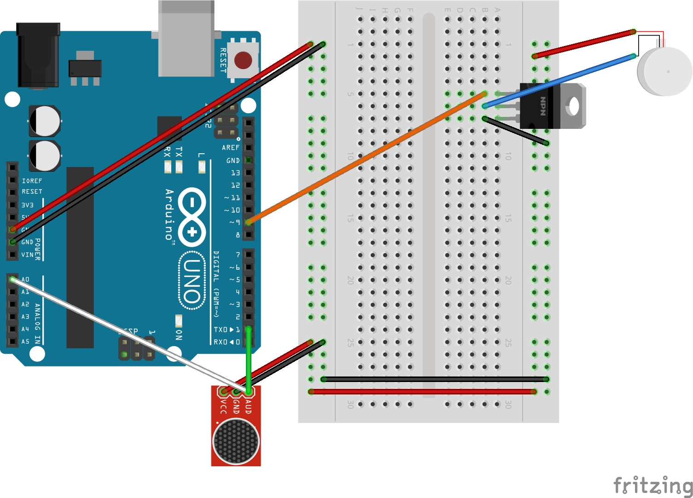

# ArduinoContest
A repository for the IEEE SOLID STATE CIRCUITS SOCIETY™ Contest

## Materials
- Arduino Uno (or compatible)
- Breadboard
- Electret microphone module
- USB cable
- Jumper wires
- NMOS Transistor
- Vibration Coin Motor

## Wiring

## Setup
Install required libraries:
- [fix_fft by Dimitrios P. Bouras](https://docs.arduino.cc/libraries/fix_fft/#Releases)

## Code 
...

## Usage 
1. Open  in the Arduino IDE.
2. Connect your Arduino to your computer using a USB cable.
3. Verify the code, then click **Upload**.
4. Open the **Serial Monitor** (top right corner) to see audio input in real time.

## Testing
Speak or play sound near the microphone to check if values change in the `Serial Monitor`.

